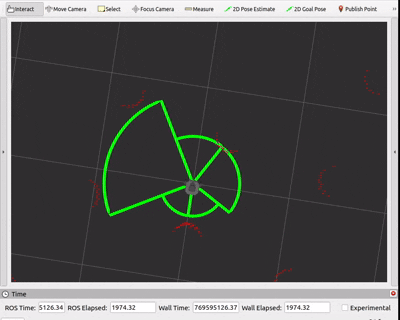

# Hamal’s Lidar Toolbox

hamals_lidar_toolbox, ROS2 tabanlı robotlar için geliştirilmiş, 2D Lidar verisini **karar verebilir**, **deterministik metriklere** dönüştüren bir C++ araç setidir.

Bu proje, LİDAR verisini “nesne algılama” amacıyla değil;

**FSM**, **safety layer** ve **hareket kararları** tarafından doğrudan tüketilebilecek sinyaller üretmek için tasarlanmıştır

# Projenin Amacı

LİDAR sensörleri ham olarak çok sayıda nokta üretir.

Ancak çoğu robot için asıl ihtiyaç şu soruların cevabıdır.

- Önüm güvenli mi?
- Hangi bölgede engel var?
- Hareket etmeli miyim, durmalı mıyım?

**hamals_lidar_toolbox,** bu sorulara cevap verecek şekilde:

- alanı bölgelere ayırır (front, left, right, rear)
- her bölge için mesafe metrikleri üretir
- danger / safe gibi **yüksek seviyeli sinyaller** publish eder.

# Tasarım Tercihi

Bu proje, **Clustering**, **RANSAC**, **DBSCAN**, **ML tabanlı preception** gibi ağır algoritmalar **içermez.**

Bunun yerine

- deterministik
- düşük gecikmeli
- debug edilebilir
- FSM dostu

bir yapı hedeflenir.

Daha karmaşık karar mekanizmalarının ayrı ROS düğümleri olarak genellikle Python tarafında yazılması amaçlanır.

# Mimari

## 1. Core (Ros-Independent)

- Saf C++
- ROS bağımlılığı yok
- Test edilebilir ve taşınabilir

## 2. ROS Adapter Katmanı

- sensor_msgs/LaserScan → core veri yapıları
- ROS node’lar ve publisher’lar

## 3. Debug & Visualization

- Rviz için bölge bazlı fan görselleştirmesi
- Danger/safe durumlarının anlık takibi

**Region-based safety visualization (real-time)**




# Dosya Yapısı

```jsx
hamals_lidar_toolbox/
├── config/
│   └── lidar.yaml                 # Region, threshold ve debug ayarları
│
├── include/
│   └── hamals_lidar_toolbox/
│       ├── analysis/
│       │   ├── CollisionRiskAnalyzer.hpp
│       │   └── RegionAnalyzer.hpp
│       │
│       ├── core/                  # ROS-independent core logic
│       │   ├── ScanData.hpp
│       │   ├── ScanFilter.hpp
│       │   ├── ScanMetrics.hpp
│       │   ├── ScanSanitizer.hpp
│       │   ├── ScanSegmenter.hpp
│       │   └── ObstacleDetector.hpp
│       │
│       ├── ros/                   # ROS-facing interfaces
│       │   ├── adapters/
│       │   │   └── LaserScanAdapter.hpp
│       │   │
│       │   ├── nodes/
│       │   │   └── scan_processor_node.hpp
│       │   │
│       │   └── rviz/
│       │       └── RvizDebugPublisher.hpp
│
├── launch/
│   └── scan_processor.launch.py   # ROS2 launch file
│
├── src/
│   ├── core/                      # Core implementations
│   │   ├── ScanData.cpp
│   │   ├── ScanMetrics.cpp
│   │   ├── ScanSanitizer.cpp
│   │   ├── ScanSegmenter.cpp
│   │   └── ObstacleDetector.cpp
│   │
│   └── ros/
│       ├── adapters/
│       │   └── LaserScanAdapter.cpp
│       │
│       ├── nodes/
│       │   └── scan_processor_node.cpp
│       │
│       └── rviz/
│           └── RvizDebugPublisher.cpp
│
│
│ 
│
├── CMakeLists.txt
├── package.xml
├── README.md
└── LICENSE
```

# Konfigürasyon

Davranış tamamen YAML üzerinden belirlenir

```yaml
scan_processor_node:
  ros__parameters:

    danger_distance: 0.3

    scan:
      min_range: 0.05
      max_range: 30.0

    regions:
      front:
        min: -0.52
        max:  0.52

      left:
        min:  0.52
        max:  2.09

      right:
        min: -2.09
        max: -0.52

      rear:
        min:  2.09
        max: -2.09

    debug:
      enable_rviz: true

```

# Paketi Çalıştırmak

```visual-basic
ros2 launch hamals_lidar_toolbox scan_processor.launch.py
```

# Bağımlılıklar

- ROS 2
- rclcpp
- sensor_msgs
- visualization_msgs
- **[hamals_lidar_msgs](https://github.com/m-gnr/hamals_lidar_msgs)** – Custom LiDAR message definitions


# Node & Topic Akışı

`scan_processor_node`, ham LiDAR verisini alır ve bunu FSM’ler ve safety layer’lar tarafından doğrudan tüketilebilecek iki ayrı çıktı haline getirir.
```text
/scan  ──▶  scan_processor_node  ──▶  /scan/debug_markers
                              └──▶  /scan/obstacle_state

```


## `/scan/obstacle_state`

Bu topic, LİDAR taramalarından elde edilen **bölge bazlı engel bilgilerini** yayınlar. Her bölge bağımsız olarak değerlendirilir ve **deterministik** bir formatta yayınlanır.

Bu yapı, FSM’ler ve üst seviye karar mekanizmaları tarafından **doğrudan tüketilmeye uygundur**.

**Örnek çıktı:**

```bash
ros2 topic echo /obstacle_region_state
```

```yaml
regions:
- region: rear
  has_obstacle: false
  min_distance: 0.86

- region: right
  has_obstacle: false
  min_distance: 0.41

- region: left
  has_obstacle: true
  min_distance: 0.28

- region: front
  has_obstacle: true
  min_distance: 0.27
```

Bu çıktı, genellikle Python ile yazılmış FSM veya karar düğümleri tarafından doğrudan kullanılmak üzere tasarlanmıştır.


## `/scan/debug_markers` (RViz)

Bu topic, sadece debug ve görselleştirme amaçlıdır.
Her bölge, RViz üzerinde fan (sector) şeklinde çizilir:

- **Yeşil** → Güvenli
- **Kırmızı** → Engel algılandı

**Bu görselleştirme:**
*bölge tanımlarının doğru çalıştığını, angle wrap-around (rear region gibi) durumların konfigürasyon hatalarını anında görmeyi sağlar.

**Bu topic karar mekanizmaları tarafından tüketilmez.
Sadece geliştiriciye geri bildirim vermek içindir.**


